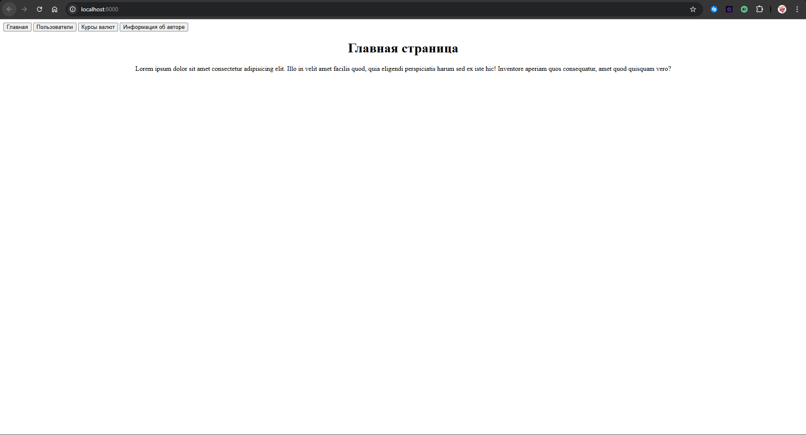
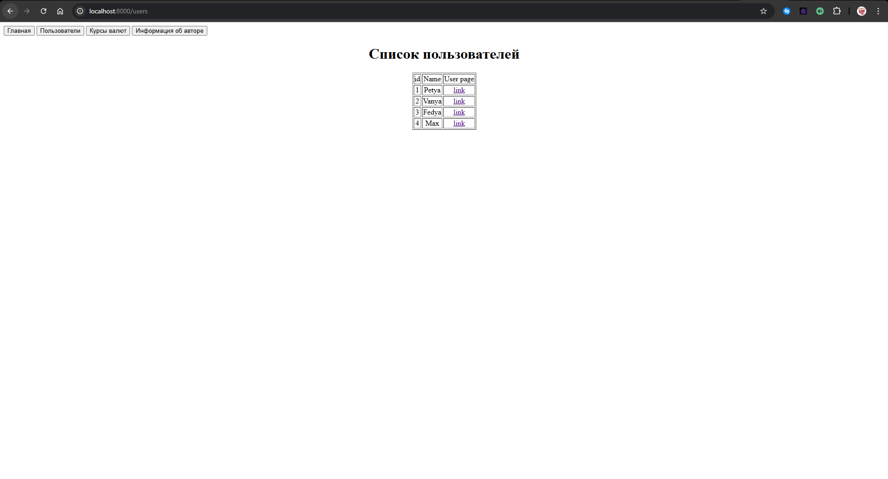
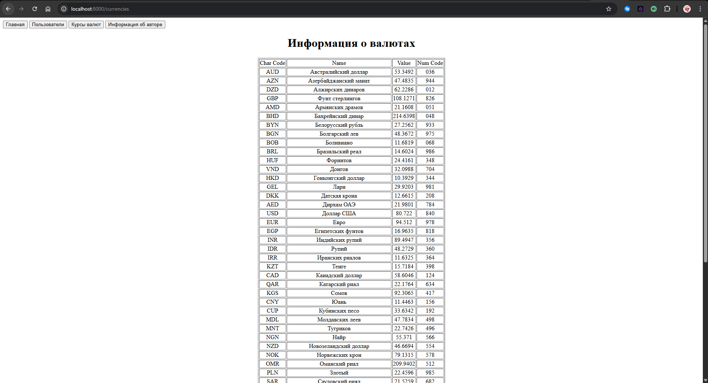
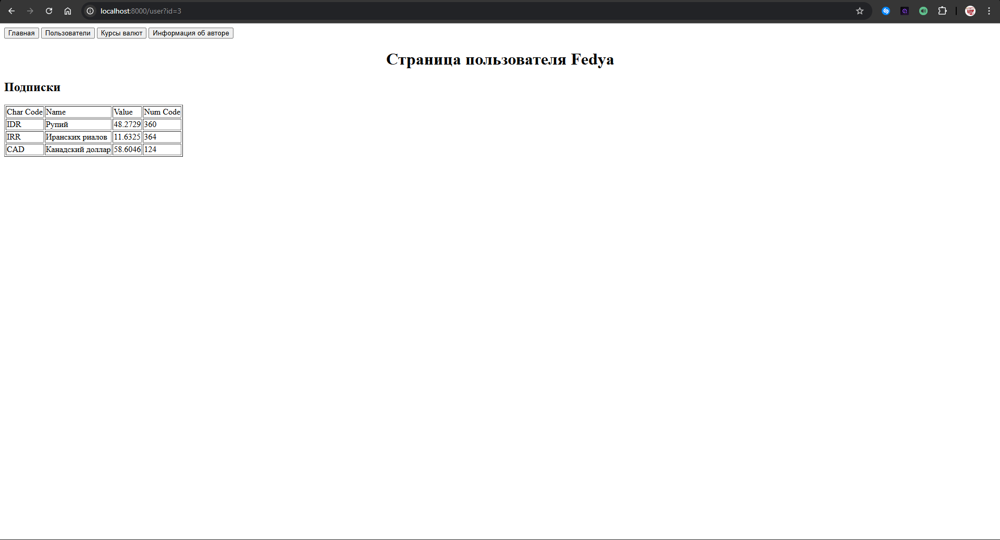

# Отчет по работе:

## Цель

Целью данной работы является разработка простого клиент-серверного веб-приложения на языке Python без использования серверных фреймворков, с применением архитектуры MVC. В ходе работы предполагается освоить базовые механизмы обработки HTTP-запросов с использованием HTTPServer и BaseHTTPRequestHandler, реализовать маршрутизацию запросов, научиться работать с шаблонизатором Jinja2 для динамического отображения данных, а также спроектировать и реализовать модели предметной области с соблюдением принципов инкапсуляции, аннотаций типов и стандартов оформления кода (PEP-8, PEP-257). Дополнительной целью является получение и обработка данных о курсах валют из внешнего источника, реализация подписки пользователей на валюты и отображение их изменений, а также приобретение практических навыков тестирования моделей и серверной логики.

## Описание предметной области

Реализованы модели:
- App
- Author
- Currency
- User_Currency
- User

Модель **App**- содержит общую информацию о приложении, такие как название, версия и автор.
**Author** - содержит информацию об авторе, имя и группу.
**Currency** - содержит информацию о валюте: id, числовой код, знаковый код, название, стоимость, номинал.
**User** - содержит информацию о пользователе - id и имя пользователя.
**User_Currency** - содержит собственный id, id пользователя и id валют. Служит для связи пользователя с валютами, на которые он подписан.

## Структура проекта

myapp
|
|-controllers
| |-__init__.py
| |-authorController.py - контроллер, отвечающий за отображение информации об авторе и главной странице
| |-currencyController.py - контроллер, отвечающий за отображение информации о валютах
| |-userController.py - контроллер, отвечающий за отображение информации о пользователях и их подписках
|
|-models
| |-__init__.py
| |-app.py - модель приложения
| |-author.py - модель автора
| |-currency.py - модель валюты
| |-user.py - модель пользователя
| |-user_currency.py - модель связи пользователя и валют
|
|-templates
| |-author.html - шаблон страницы автора
| |-currencies.html - шаблон страницы валют
| |-index.html - шаблон главной страницы
| |-user.html - шаблон страницы пользователя
| |-users.html - шаблон страницы пользователей
|
|-utils
| |-__init__.py
| |-currency_api.py - утилита для получения и обновления курсов валют из внешнего источника
|
|-tests
|  |-__init__.py
|  |-test_models.py - тесты для моделей
|  |-test_controllers.py - тесты для контроллеров
|  |-test_templates.py - тесты для утилит
|  |-test_get_currencies.py - тесты для получения курсов валют
|
|-logs.log - файл логов
|-myapp.py - основной файл приложения, содержащий сервер и маршрутизацию

pictures
|-главная.png - скриншот главной страницы
|-Пользователи.png - скриншот страницы пользователей
|-Валюты.png - скриншот страницы валют
|-Автор.png - скриншот страницы автора
|-Страница_пользователя.png - скриншот страницы пользователя

README.md - файл с описанием проекта

## Описание реализации

### Модели:
Модель **App** реализована в файле app.py и содержит атрибуты name: str, version: str и author: str. 
Модель **Author** реализована в файле author.py и содержит атрибуты id: int, name: str и group: str. 
Модель **Currency** реализована в файле currency.py и содержит атрибуты id: int, num_code: str, char_code: str, name: str, value: float и nominal: int. 
Модель **User** реализована в файле user.py и содержит атрибуты id: int и username: str. 
Модель **User_Currency** реализована в файле user_currency.py и содержит атрибуты id: int, user_id: int и currency_id: int. 

Для всех моделей реализована проверка типов данных с использованием isinstance(). Сеттеры реализованы через свойства (property). Все модели оформлены в соответствии с PEP-8 и PEP-257.

### Контроллеры:
Контроллеры реализованы в папке controllers. Каждый контроллер отвечает за обработку запросов и взаимодействие с соответствующими моделями и шаблонами.
- **authorController.py** - обрабатывает запросы к главной странице и странице автора.
- **currencyController.py** - обрабатывает запросы к странице валют.
- **userController.py** - обрабатывает запросы к странице пользователей и странице конкретного пользователя.

### Утилиты:
В папке utils реализована утилита currency_api.py, которая отвечает за получение и обновление курсов валют из внешнего источника (например, API Центробанка). Утилита использует библиотеку requests для выполнения HTTP-запросов и обработки полученных данных.

### Шаблонизатор:
Для динамического отображения данных используется шаблонизатор **Jinja2**. Шаблоны расположены в папке *templates* и включают:
- **index.html** - шаблон главной страницы
- **author.html** - шаблон страницы автора
- **currencies.html** - шаблон страницы валют
- **users.html** - шаблон страницы пользователей
- **user.html** - шаблон страницы конкретного пользователя
Используется инициализация окружения Jinja2 с указанием папки шаблонов и рендеринг шаблонов с передачей данных из контроллеров. *Environment* настроено с использованием *FileSystemLoader* для загрузки шаблонов из папки *templates*.

### Сервер и маршрутизация:
Основной файл приложения myapp.py содержит реализацию HTTP-сервера с использованием HTTPServer и BaseHTTPRequestHandler. В файле реализована маршрутизация запросов к соответствующим контроллерам на основе URL-путей.

## Тестирование
Тестирование моделей, контроллеров и утилит реализовано в папке tests с использованием библиотеки unittest. Тесты проверяют корректность работы моделей, правильность обработки запросов контроллерами и функциональность утилиты для получения курсов валют.

# Картинки:

### Главная страница:

### Пользователи:

### Валюты:

### Автор:

### Пользователь:
